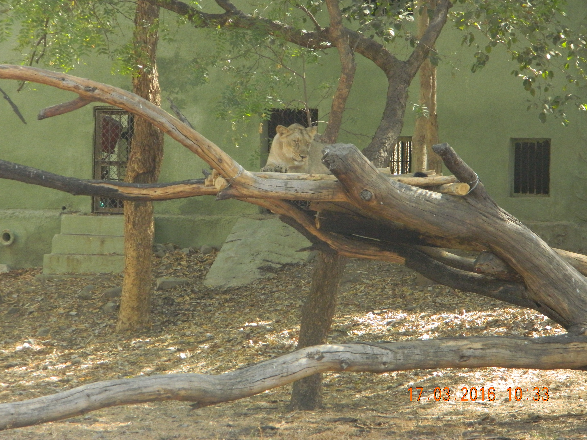
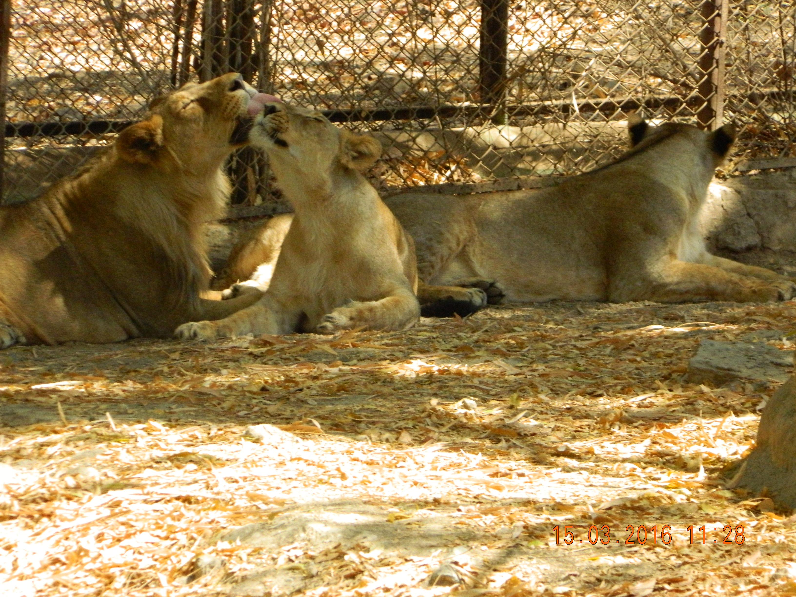
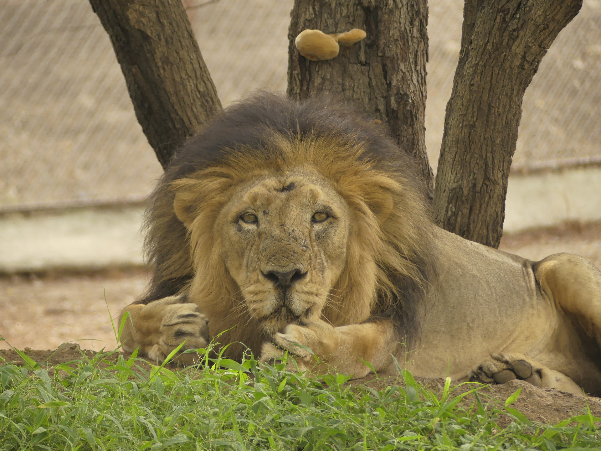

```{r setup, include=FALSE}
library(tidyverse)
library(readxl)
library(easystats)
library(ggstatsplot)
#library(fontawesome)
library(extrafont)
#library(googlefont)
library(ggtext)
library(ggsignif)
library(icons)
library(xaringanExtra)
library(xaringanthemer)
library(thematic)
library(pairwiseComparisons)
library(ggsignif)
##]
library(DescTools)
library(knitr)
#library(colourpicker)
library(magrittr)
library(readxl)
library(dplyr)
library(ggplot2)
#library(gt)
library(glue)
library(ggpubr) # for arranging graphs together in ggarrange
library(foreign)# used for loading data file sin different formats in r
library(ggpubr)# required for ggboxplot
library(psych)
#loads most of the models required for data wrangling in R
library(tidyr)
library(patchwork)
# library(wesanderson)
library(reshape2)# join graphs
library(data.table)# used forfread and data manipulation at varioud levels
library(sur)# used for table and percent.table function
#install.packages("colourpicker", dependencies =TRUE)
#library(repurrrsive)
##
#install.packages("icon")
options(htmltools.dir.version = FALSE)
knitr::opts_chunk$set(
  fig.width=12, fig.height= 5, fig.retina=4,
  out.width = "100%",
  fig.align = "center",
  cache = FALSE,
  echo = FALSE,
  message = FALSE, 
  warning = FALSE,
  hiline = TRUE
)
xaringanExtra::use_webcam()
xaringanExtra::use_progress_bar(color = "#0051BA", location = "top")
# xaringanExtra::use_search(show_icon = TRUE)
xaringanExtra::use_panelset()
xaringanExtra::style_panelset_tabs(font_family = "inherit")
xaringanExtra::use_share_again()

```


```{r, include=FALSE, echo=FALSE}
library(tidyverse)
getwd()
#setwd("home/sitendu/rproj")
raw <- readxl::read_xlsx("data/raw.xlsx", sheet = "peerj submit")
raw<- raw %>% mutate(across(c(Personality, lifehistory), factor))
raw <- raw %>% janitor::clean_names()
raw <- as_tibble(raw)
glimpse(raw)
#setwd("/home/sitendu/rproj/ethogram")
behave <- read_xlsx("data/enrich.xlsx", sheet = "Sheet9")

```
```{r xaringan-themer, include=FALSE, warning=FALSE}
# library(xaringanthemer)
# style_solarized_light(
#   header_font_google = google_font("Josefin Slab", "600"),
#   text_font_google = google_font("Work Sans", "300", "300i"),
#   code_font_google = google_font("IBM Plex Mono"),
#   text_color=  "#1c5253",
#   header_color = "#9F0000"
# )
# thematic::thematic_on(bg = "auto",
#                         font =  "Work Sans")
```
```{r, eval=FALSE}

glimpse(raw)
raw |> select(where(is.factor))
raw<- raw |> mutate(across(.cols = where(is.factor), .fns = as.character))
attribute.label<- c(
  "aberrant_repetitive_behaviour_perecentage" = "ARB",
  "behaviour_diversity" = "Behaviour diversity",
  "enclosure_usage"= "Enclosure usage"
)
# raw |> 
#   pivot_longer(cols = c(4,5,6,7,9), values_to = "values", names_to = "attributes") |> 
#   mutate(persrear = case_when( personality == 1 & lifehistory == 1 ~ "wildbold",
#                                personality == 0 & lifehistory == 1 ~ "wildshy",
#                                personality == 1 & lifehistory == 0 ~ "captivebold",
#                                personality == 0 & lifehistory == 0 ~ "captiveshy")) |> 
#   pivot_longer(cols = c(2,3), values_to = "traits", names_to = "ind") |> 
#   filter(attributes != "age_in_days" , attributes != "latency_in_seconds") |> 
#   ggplot(aes(x = persrear, y = values)) +
#   geom_boxplot(aes(fill = persrear)) + 
#   geom_point()+
#   xlab("Personality trait and rearing-history")+
#   ylab("Values") +
#   ggtitle(" Welfare indices of Asiatic lions with different personality traits and rearing histories")+
#   facet_grid(rows = vars(attributes), scales = "free", labeller = as_labeller(attribute.label)) +
#   theme(plot.title = element_text(hjust = 0.5), legend.position = "none")
raw2<- raw |> 
  pivot_longer(cols = c(4,5,6,7,9), values_to = "values", names_to = "attributes") |> 
  mutate(persrear = case_when( personality == 1 & lifehistory == 1 ~ "wildbold",
                               personality == 0 & lifehistory == 1 ~ "wildshy",
                               personality == 1 & lifehistory == 0 ~ "captivebold",
                               personality == 0 & lifehistory == 0 ~ "captiveshy")) |> 
  pivot_longer(cols = c(2,3), values_to = "traits", names_to = "ind") 
glimpse(raw2)

```


```{r xaringan-themer1, include=FALSE, warning=FALSE}
library(xaringanthemer)
style_duo_accent(
  primary_color = "#DCAB6B",
  secondary_color = "#774E24",
  header_color = "#9F0000",
  inverse_header_color= "#FFFFB3",
  header_font_google = google_font("Lora", "400", "400i"),
  text_font_google = google_font("Anonymous Pro", "monopace", "400"),
  text_color=  "#1c5253",
  background_color = "#fdf6e3",
  code_font_google = google_font("IBM Plex Mono"),
  #title_slide_background_color = "90BE6D"
)
thematic::thematic_on(
  fg= "auto",
  accent= "#1c5253",
  bg= "#fdf6e3",
  font = "Work Sans"
)
# thematic_rmd()
```


class: center
background-color: "#90BE6D"

## Effects of personality and rearing-history on the welfare indices of captive Asiatic lions


 __Animal Behavior Society__, 
 
   August 3,  2021
 
 
   Sitendu Goswami, PC Tyagi, PK Malik, Samrat Mondol
 

 
 
 
 
 
.footer[
`r fontawesome::fa("github")` sitendug.github.io/ABS21/#1


`r fontawesome::fa("envelope-open")` sitendugoswami@gmail.com

`r fontawesome::fa("paperclip")` [Goswami et al., 2020](https://peerj.com/articles/8425/)


]

???
-   Good evening, I am Sitendu Goswami, I am a doctoral scholar at Wildlife Institute of India. 

-   I am thankful to  Animal behavior society for creating this online virtual conference, which provides equitable opportunities to academics from third world countries like myself to attend and share our findings in an ecologically and economically sustainable manner.

-   Today, I will discuss the effects of personality and rearing-history on the welfare indicators of Asiatic lions housed at the largest conservation breeding center.
-   My talk forms a small part of the larger study funded and supported by the Zoological Society of London, Wildlife Institute of India, and Gujarat forest department.
-   There are presently 674 Asiatic lions in the wild, and 300 lions form the global captive population.
-   While in-situ research on Asiatic lions has led to several affirmative conservation actions, there have been no studies reported from the ex-situ management program for the species
.  
-   this study was conducted between 2015-2018 and is the first to investigate the welfare status of captive Asiatic lions

  

---
layout: split:three

## Sakkarbaug Zoological Garden (SZG)

.column[]
.columns[]
.column[]


-  Established in 1863 to treat injured and infirm wild Asiatic lions from Gir forest.
-  Epicenter of _ex-situ_ conservation of Asiatic lions ( _Panthera leo persica_ ).
-  Holds the largest captive population of Asiatic lions( N ~ 60).
-  Home to both captive-born and wild-rescued asiatic lions.


???

-  My study Site is Sakkarbaug zoological garden, which falls within the natural range of Asiatic lions.
-  Established in 1863 as a menagerie for the royal family of Junagadh( a princely state in British India), This zoo has a long history with Asiatic lion conservation. 
-  Since its foundation, this zoo has been associated with the rehabilitation and breeding of Asiatic lions and presently houses 60 Asiatic lions, that includes a large number of wild-rescued animals.
-  SZG  is of immense importance to Asiatic lion conservation and therefore it is imperative to audit and improve their incumbent management practices for the species regularly.


---
class: split-three

## Subjects 

.column[]
.column[]
.column[]

-  15 enclosures all off-display, large and naturalistic in design
-  N = 35(14:21)
-  Rescued = 19 (11:8)
-  Captive-born = 16(3:13)
-  Mean-age= 7.6 years (SD = 3.9 years)
-  pair-housed = 17
-  group-housed = 18
???


-  The results of this presentation are gathered from the first six months of the larger study.
-  Study subjects were 35 adult Asiatic lions housed across 15 large naturalistic enclosures.
-  19 of these individuals were rescued from the wild either as sub-adults or adults
-  The rest were born in captivity.
-  At the time of the study the average age of the subjects ranged between 4-10 years.

---
class: center, middle

##   Research question

  What are the effects of personality traits and  rearing-history  on Asiatic lion welfare?


.footer[https://peerj.com/articles/8425/]

???

-  We wanted to see if rearing-history and personality traits especially along the bold-shy continuum can have a bearing on the welfare indicators of lions housed under similar captive conditions.
-  We also looked at other factors such as sex, age,  and social grouping but due to time constraints, I am unable to cover it today.
-  I invite you to peruse our paper, linked below, which provides a more nuanced description of our methodology and findings.
program


---
class:left

##  Methods - Personality trait assessment
.panelset[
.panel[.panel-name[Process]


1.  Keeper rating  bold or shy score of 1-9 ( 9 being very bold and 1 very shy).
    -   keeper ratings used to group subjects as bold or shy
    -   Subjects with ambiguous ratings dropped

2.  Non-food novel object test
    -  Latency to a 10 minute exposure to a non-food novel object recorded
    -  Reaction time and type of response recorded
    -  Independent observers ( n =3) group subjects as bold or shy.

3.  Bold and shy group affiliations matches with inter-rater reliability tests
]

.panel[.panel-name[Novel-object tests]
<center> <video width="720" height="360" controls>
  <source src="figures/asiatic lionnovel.mp4">
  <controller = "true">
</video> </center>
]
.panel[.panel-name[Groups]
```{r, echo=FALSE}
raw2<- raw |>
  pivot_longer(cols = c(4,5,6,7,9), values_to = "values", names_to = "attributes") |>
  mutate(persrear = case_when( personality == 1 & lifehistory == 1 ~ "wildbold",
                               personality == 0 & lifehistory == 1 ~ "wildshy",
                               personality == 1 & lifehistory == 0 ~ "captivebold",
                               personality == 0 & lifehistory == 0 ~ "captiveshy")) |>
  pivot_longer(cols = c(2,3), values_to = "traits", names_to = "ind") |> distinct(name, persrear)

kableExtra::kable(table(raw2$persrear),col.names = c("Group", "Number of subjects"))
```

-  Bold animals(N= 21)

-  Shy animals ( N = 14)


]
]
???
 We already knew about the rearing history of the subjects.
-  To categorize subjects based on boldness or shyness, we took a two-pronged approach
-  first, we asked keepers with more than three years of experience to rate subjects on a scale of 1-9.
-  Then we introduced each subject separately to non-food novel objects and recorded their reaction
-   Independent observers recorded the latency times to react to novel objects and the type of behavior ( playful, fearful, curious) performed by the animal.
-   We created our own list of bold and shy animals and compared the same with keepers.
-   We only included individuals whose personality traits were agreed upon by keepers and observers. 
-   Show the video

- Next panel
  -   As you can see the two primary groups were captivebold and wild shy individuals each having twelve and fourteen individuals, the third group was that of 7 wild shy individuals. captiveshy individuals formed the smallest group.

---
class:left
## Methods -  Behavioural welfare indices

.panel[.panel[.panel-name[Behaviour]

-  Enclosures divided into ten zones. 
-  Instantaneous scan samples at 1 minute intervals for one hour at 6 hour observation blocks.

-  During each scan the behavioural state, and the location of each animal recorded.

   -   Aberrant repetitive behaviours
   
   -   Behaviour diversity
   
   -   Enclosure usage pattern with Spread of participation index
   
-   57 hours of observation data per subject 


]
]
???

-  To collect the behavioral data, we divided the enclosures into ten equal zones
-  We used instantaneous scans at 1-minute intervals for one hour followed by a 15-minute rest to reduce observer fatigue.*
-  observations were made in six-hour blocks  between 5-11 and 1300-1900 hours
-  In total, we collected 57 hours of scan observation data per subject
-  During each scan we recorded the behavioral state of the animal and the enclosure zone it was using.*
-  We counted the scans in which animals were performing species-typical behaviors and aberrant repetitive behaviors and also measured the total amount of time they spent on different enclosure zones.


---
class:left


##  Aberrant repetitive behaviours

.panelset[
.panel[.panel-name[ARB]
 The proportion of hourly scans from each subject calculated

 <center> <video width="960" height="400" controls>
  <source src="figures/lionarb.mp4">
  <controller = "true">
</video> </center>

]

.panel[.panel-name[Results]
```{r, fig.align='center'}
# raw |> 
#   pivot_longer(cols = c(4,5,6,7,9), values_to = "values", names_to = "attributes") |> 
#   mutate(persrear = case_when( personality == 1 & lifehistory == 1 ~ "wildbold",
#                                personality == 0 & lifehistory == 1 ~ "wildshy",
#                                personality == 1 & lifehistory == 0 ~ "captivebold",
#                                personality == 0 & lifehistory == 0 ~ "captiveshy")) |> 
#   pivot_longer(cols = c(2,3), values_to = "traits", names_to = "ind") |> 
#   filter(attributes == "aberrant_repetitive_behaviour_perecentage") |> 
#   ggplot(aes(x = persrear, y = values)) +
#   geom_boxplot(aes(fill = persrear)) + 
#   geom_point()+
#   xlab("Personality trait and rearing-history")+
#   ylab("Aberrant Repetitve behaviour(%)") +
#  # ggtitle(" Welfare indices of Asiatic lions <br> with different personality traits and rearing histories")+
#   theme(plot.title = element_markdown(hjust = 0.5, size = 12), legend.position = "none",
#         strip.text = element_text(size=12),
#         axis.title = element_text(size = 14))
```
```{r}
raw |> 
  pivot_longer(cols = c(4,5,6,7,9), values_to = "values", names_to = "attributes") |> 
  mutate(persrear = case_when( personality == 1 & lifehistory == 1 ~ "wildbold",
                               personality == 0 & lifehistory == 1 ~ "wildshy",
                               personality == 1 & lifehistory == 0 ~ "captivebold",
                               personality == 0 & lifehistory == 0 ~ "captiveshy")) |> 
  pivot_longer(cols = c(2,3), values_to = "traits", names_to = "ind") |> 
  filter(attributes == "aberrant_repetitive_behaviour_perecentage") |> 
  distinct(name, values, persrear) |> 
  ggbetweenstats( x = persrear, y = values, pairwise.display = "significant", type = "np",
               xlab = "Personality trait and rearing-history",
               ylab = "Aberrant repetitive beahviours (ARB)") + theme_xaringan()+ 
  theme(plot.title = element_markdown(hjust = 0.5, size = 12), legend.position = "none",
        strip.text = element_text(size=12),
        axis.title = element_text(size = 14)) 
```

]
]
???

-  The most common ARBs were movement-based ones like swaying, nose-rubbing, and pacing.
-  Results
   -   Since We collected the same amount of data for each subject
   -   it was easy for us to represent the data in the form of the percentage of scans spent performing ARBs for all subjects.
   -  If you focus on the captive bold and wildshy animals, you will notice that they are quite different. 
   -    it is interesting to note that there is a certain amount of overlap across the groups.
   -   Curiously the captivebold animals and wild bold animals are quite similar to each other.
   -   Similarly, the captiveshy and wildshy animals are quite similar in their proportion of ARBs.


---
class:left
##  Behaviour diversity 

.panelset[
.panel[.panel-name[Behaviour diversity]

-  Hourly count of species-typical behaviours used to calculate behaviour diversity.

-  
Count of scans for species-typical behaviours
$$Behaviour\ diversity = \sum {p_{i}*\log p_{i}}$$
$$p_{i} = The\  proportion\ of\ time\ spent\ in\ each\ species-typical\ behaviour$$
]
.panel[.panel-name[Results]
```{r}
# raw |> 
#   pivot_longer(cols = c(4,5,6,7,9), values_to = "values", names_to = "attributes") |> 
#   mutate(persrear = case_when( personality == 1 & lifehistory == 1 ~ "wildbold",
#                                personality == 0 & lifehistory == 1 ~ "wildshy",
#                                personality == 1 & lifehistory == 0 ~ "captivebold",
#                                personality == 0 & lifehistory == 0 ~ "captiveshy")) |> 
#   pivot_longer(cols = c(2,3), values_to = "traits", names_to = "ind") |> 
#   filter(attributes == "behaviour_diversity") |> 
#   ggplot(aes(x = persrear, y = values)) +
#   geom_boxplot(aes(fill = persrear)) + 
#   geom_point()+
#   stat_compare_means(method = "wilcox.test",label.y =2,paired = FALSE)+
#   xlab("Personality trait and rearing-history")+
#   ylab("Behaviour diversity (SWI)") +
#   #ggtitle(" Welfare indices of Asiatic lions <br> with different personality traits and rearing histories")+
#   theme(plot.title = element_markdown(hjust = 0.5, size = 12), legend.position = "none",
#         strip.text = element_text(size=12),
#         axis.title = element_text(size = 14))
```

```{r, echo=FALSE}
raw2bd<- raw |> 
  pivot_longer(cols = c(4,5,6,7,9), values_to = "values", names_to = "attributes") |> 
  mutate(persrear = case_when( personality == 1 & lifehistory == 1 ~ "wildbold",
                               personality == 0 & lifehistory == 1 ~ "wildshy",
                               personality == 1 & lifehistory == 0 ~ "captivebold",
                               personality == 0 & lifehistory == 0 ~ "captiveshy")) |> 
  pivot_longer(cols = c(2,3), values_to = "traits", names_to = "ind") |> 
  filter(attributes == "behaviour_diversity") 
#raw2bd
#glimpse(raw2bd)
raw2bd<- raw2bd |> distinct(name, values, persrear)
ggbetweenstats(raw2bd, x = persrear, y = values, pairwise.display = "significant", type = "np",
               xlab = "Personality trait and rearing-history",
               ylab = "Behaviour diversity(SWI)") + theme_xaringan()+ 
  theme(plot.title = element_markdown(hjust = 0.5, size = 12), legend.position = "none",
        strip.text = element_text(size=12),
        axis.title = element_text(size = 14)) 
```

]
]
???

-  Behaviour diversity is an important positive indicator for animal welfare that has gained traction in the past few decades.
-  We used the Shannon Weiner diversity index to calculate this welfare index.
-  Results
   -   Here we see a similar trend that was highlighted in the ARb section
   -  Captivebold and wildshy animals were diametrically opposite to one another, and the captiveshy and wildbold animals lay somewhere in between.
   -  It was interesting to note that the captiveshy animals had higher behaviour diversity than the wildshy animals.
   -  This loss in behaviour diversity in wild animals could be speculatively attributed to the fact that most of them were rescued as adults.
   -  Hence in captivity, these wild-rescued lions do not have access to the complex range of stimuli linked with diverse behavioral repertoires.
   -  Although the enclosures at SZG are large, naturalistic, and provide for the captive-born animals, they are unable to meet the requirement of the wild-rescued individuals.

---
class:left
##  Enclosure usage- Spread of participation index (SPI)
.panelset[
.panel[.panel-name[Enclosure use]


1.  Enclosures divided into ten zones
2.  Number of scans spent at each zone per animal was recorded.
3.  Enclosure use homogeneity with Spread of Participation Index
 $$SPI = \frac {\sum |f_{o}-f_{e}|} {2(N-f_{emin})}$$
 $$f_{o} = observed \  count \  of \  scans\   spent\   in  \ zone_{i}$$
 $$f_{e} =  expected \  count  \ of  \  scans \ spent  \ in\   zone_{i}$$
 $$N = Total   number  \ of \  scans$$
$$ f_{emin} =  number  \ of  \ scans \  expected \  from\   the \  smallest\   zone$$


]
.panel[.panel-name[Results]
```{r}
# raw |> 
#   pivot_longer(cols = c(4,5,6,7,9), values_to = "values", names_to = "attributes") |> 
#   mutate(persrear = case_when( personality == 1 & lifehistory == 1 ~ "wildbold",
#                                personality == 0 & lifehistory == 1 ~ "wildshy",
#                                personality == 1 & lifehistory == 0 ~ "captivebold",
#                                personality == 0 & lifehistory == 0 ~ "captiveshy")) |> 
#   pivot_longer(cols = c(2,3), values_to = "traits", names_to = "ind") |> 
#   filter(attributes == "enclosure_usage") |> 
#   ggplot(aes(x = persrear, y = values)) +
#   geom_boxplot(aes(fill = persrear)) + 
#   geom_point()+
#   xlab("Personality trait and rearing-history")+
#   ylab("Enclosure usage (SPI)") +
#  # ggtitle(" Welfare indices of Asiatic lions <br> with different personality traits and rearing histories")+
#   theme(plot.title = element_markdown(hjust = 0.5, size = 12), legend.position = "none",
#         strip.text = element_text(size=12),
#         axis.title = element_text(size = 14))
```
```{r}
raw |> 
  pivot_longer(cols = c(4,5,6,7,9), values_to = "values", names_to = "attributes") |> 
  mutate(persrear = case_when( personality == 1 & lifehistory == 1 ~ "wildbold",
                               personality == 0 & lifehistory == 1 ~ "wildshy",
                               personality == 1 & lifehistory == 0 ~ "captivebold",
                               personality == 0 & lifehistory == 0 ~ "captiveshy")) |> 
  pivot_longer(cols = c(2,3), values_to = "traits", names_to = "ind") |> 
  filter(attributes == "enclosure_usage") |> 
  distinct(name, values, persrear) |> 
  ggbetweenstats( x = persrear, y = values, pairwise.display = "significant", type = "np",
               xlab = "Personality trait and rearing-history",
               ylab = "Enclosure usage(SPI)") +
  theme_xaringan()+
  theme(plot.title = element_markdown(hjust = 0.5, size = 12), legend.position = "none",
        strip.text = element_text(size=12),
        axis.title = element_text(size = 14)) 
```


]
]
???
-   Enclosures can be large and look natural to us  but they should be functional for the animals housed in them
-   We calculated the spread of the participation index which measures if all zones of the enclosure are used equitably.
-  Results

  -   The value of SPI ranges from 0-1 with 1 denoting that the animals have a significant preference for one or two zones and do not use the rest of the areas.
  -    A value below 0.5 is usually considered acceptable.
  -   We found that the SPI values for wild shy animals were uncomfortably high, which meant that they spent most of their time at a single part of the enclosure without exploring the other zones. 
  -   On the other hand, animals from the other groups used most parts of the enclosure equitably.
  -   Therefore we see that wild-rescued shy animals are performing more stereotypy, showing fewer species-typical behaviors and performing more aberrant behaviors as compared to captive born animals.
  -   These findings are indicative of the fact that personality traits and rearing history lead to different welfare outcomes even under similar housing conditions.


---
class:left

##  Summary of findings

1.   Inter-individual differences can lead to differential welfare outcomes.

2.   Personality traits on the bold-shy continuum provides key insights to welfare requirement.

3.   Wild-rescued lions with shy personality trait require special attention.

4.   Sex and social pairing does not seem to have any association to welfare indices.

5.   Regular welfare monintoring should be integrated with all ongoing conservation breeding programmes.


.footer[
citation :  Goswami S, Tyagi PC, Malik PK, Pandit SJ, Kadivar RF, Fitzpatrick M, Mondol S. 2020. Effects of personality and rearing-history on the welfare of captive Asiatic lions (*Panthera leo persica*) PeerJ 8:e8425 https://doi.org/10.7717/peerj.8425 
]

???
-  Therefore,  individual variations can lead to differential welfare outcomes for similarly housed conspecifics.

-   Traditionally, ex-situ institutions have the same husbandry and management practices for all individuals of the species.

-   Our study shows that we need to have an individual-centric or better-still trait-based management practice, that can lead to better welfare outcomes. 


-  Keepers usually have a keen understanding of the animals under their care. Hence, they should be consulted while tailoring husbandry practices to individual requirements.

-   Welfare monitoring vital for the long term success of ex-situ conservation programmes


---
class: center


## Acknowledgements


  Funding agency: Zoological Society of London, UK
  
  
  Collaborators: Gujarat Forest Department, India
  
  
  Director and Dean, Wildlife Institute of India
  
  
  Field assistant: Mr. Ashkar Bloch
  
  
  SZG staff: Mr. Salim Chuvan & team
  
  


---
class: center, middle
Slides created via the R packages:

[**xaringan**](https://github.com/yihui/xaringan)<br>
[gadenbuie/xaringanthemer](https://github.com/gadenbuie/xaringanthemer)

The chakra comes from [remark.js](https://remarkjs.com), [**knitr**](http://yihui.name/knitr), and [R Markdown](https://rmarkdown.rstudio.com).

